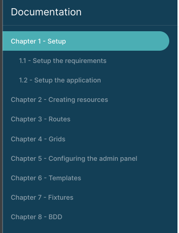

# Basic usage

Markdown templates are on `docs` directory.

You can customize your main docs directory: 

```yaml
# config/packages/mobizel_markdown_docs.yaml

mobizel_markdown_docs:
    contexts:
        main:
            path: /docs
            docs_dir: '/path/to/your/docs'
```

Your files are already available on your server.

Example:
`docs/dummy/foo.md` is available at [/docs/dummy/foo](http://localhost:8000/docs/dummy/foo)

## Menu
By default, menu items are sorted by titles, but you can [customize positions of your pages](how-to-customize-pages-positions.md).



Titles are extracted from the content of your markdown files.

Example `foo.md`:
```markdown
# Chapter 1 - Setup

Here is the content of your page.
```

The title of your page will be "Chapter 1 - Setup".
